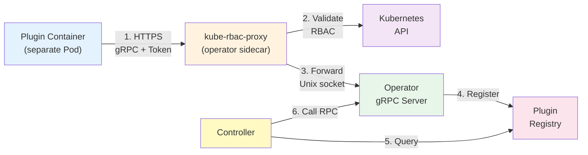

# Token Renewer

A Kubernetes operator that automatically renews API tokens for various cloud providers through a secure gRPC plugin architecture.

## Overview

Token Renewer manages the lifecycle of API tokens stored in Kubernetes Secrets. It automatically renews tokens before expiration using provider-specific plugins that communicate securely via gRPC over HTTPS (protected by kube-rbac-proxy).

**Key Features:**
- ✅ **Automatic Token Renewal**: Monitors and renews tokens before expiration
- ✅ **Secure Plugin Architecture**: HTTPS/TLS communication with ServiceAccount token authentication
- ✅ **Kubernetes-Native**: Uses Custom Resources and Secrets
- ✅ **Multi-Provider Support**: Extensible design for any cloud provider
- ✅ **Event Logging**: Kubernetes events for audit trail

## Getting Started

### Prerequisites
- Kubernetes 1.23+
- kubectl configured to access your cluster
- Go 1.23+ (for development)
- Docker (for building images)

### Quick Start

**1. Create a Secret with your token:**
```bash
kubectl create secret generic my-token --from-literal=token=YOUR_API_TOKEN
```

**2. Deploy the operator:**
```bash
make deploy IMG=your-registry/token-renewer:latest
```

**3. Create a Token resource:**
```yaml
apiVersion: token-renewer.barpilot.io/v1beta1
kind: Token
metadata:
  name: my-token
spec:
  provider:
    name: linode                # Plugin provider name
  metadata: "12345"             # Provider-specific ID (e.g., Linode token ID)
  renewval:
    beforeDuration: 24h         # Renew 24 hours before expiration
  secretRef:
    name: my-token              # Secret containing the token
```

**4. Monitor token renewal:**
```bash
kubectl get tokens -w
kubectl describe token my-token
```

## Project Distribution

Following the options to release and provide this solution to the users.

### By providing a bundle with all YAML files

1. Build the installer for the image built and published in the registry:

```sh
make build-installer IMG=<some-registry>/token-renewer:tag
```

**NOTE:** The makefile target mentioned above generates an 'install.yaml'
file in the dist directory. This file contains all the resources built
with Kustomize, which are necessary to install this project without its
dependencies.

2. Using the installer

Users can just run 'kubectl apply -f <URL for YAML BUNDLE>' to install
the project, i.e.:

```sh
kubectl apply -f https://raw.githubusercontent.com/<org>/token-renewer/<tag or branch>/dist/install.yaml
```

### By providing a Helm Chart

1. Build the chart using the optional helm plugin

```sh
kubebuilder edit --plugins=helm/v1-alpha
```

2. See that a chart was generated under 'dist/chart', and users
can obtain this solution from there.

**NOTE:** If you change the project, you need to update the Helm Chart
using the same command above to sync the latest changes. Furthermore,
if you create webhooks, you need to use the above command with
the '--force' flag and manually ensure that any custom configuration
previously added to 'dist/chart/values.yaml' or 'dist/chart/manager/manager.yaml'
is manually re-applied afterwards.

## Developing Plugins

Token Renewer uses the **operator-plugin-framework** for secure plugin communication. Plugins connect via HTTPS (gRPC/TLS) through kube-rbac-proxy.

### Creating a New Provider Plugin

**1. Create plugin directory:**
```bash
mkdir -p plugins/myprovider
cd plugins/myprovider
```

**2. Implement the gRPC service:**

```go
package main

import (
    "context"
    "time"
    "github.com/guilhem/token-renewer/shared"
)

type MyProvider struct{}

func (p *MyProvider) RenewToken(ctx context.Context, metadata, token string) (string, string, *time.Time, error) {
    // 1. Create new token with provider API
    // 2. Delete old token (if needed)
    // 3. Return: newToken, newMetadata, expirationTime, error
    return newToken, newMetadata, &expirationTime, nil
}

func (p *MyProvider) GetTokenValidity(ctx context.Context, metadata, token string) (*time.Time, error) {
    // Query provider API for token expiration
    return &expirationTime, nil
}
```

**3. Create main function to connect to operator:**

```go
func main() {
    // Connect to operator via kube-rbac-proxy using ServiceAccount token
    ctx := context.Background()
    conn, err := client.New(
        ctx,
        "myprovider",
        "https://operator-kube-rbac-proxy:8443",
        client.WithServiceAccountToken(),
    )
    if err != nil {
        log.Fatal(err)
    }
    defer conn.Close()
}
```

**4. Deploy as separate container with kube-rbac-proxy sidecar** (see `examples/linode/`)

## Development

### Essential Commands

```bash
# Code generation (required after API changes)
make manifests generate

# Testing
make test              # Unit tests
make test-e2e          # E2E tests (requires Kind cluster)

# Linting & formatting
make lint              # Run golangci-lint
make fmt vet           # Format and vet code

# Building & deployment
make docker-build IMG=your-registry/token-renewer:tag
make deploy IMG=your-registry/token-renewer:tag

# Cleanup
make undeploy          # Undeploy controller
make uninstall         # Delete CRDs
```

### Protocol Buffers

Update gRPC definitions in `proto/`:
```bash
buf generate     # Generate Go code from .proto files
```

## Architecture



**Flow:**
1. Plugin connects via HTTPS with ServiceAccount token
2. kube-rbac-proxy validates token and RBAC permissions
3. Forwarded to operator's Unix socket
4. Plugin auto-registers in registry
5. Controller queries registry and calls plugin methods
6. Token renewed and stored in Secret

### Components

- **Controller**: Watches Token CRs, manages reconciliation and renewal
- **gRPC Server**: Listens for plugin connections via operator-plugin-framework
- **Plugin Registry**: Auto-registers plugins on connection
- **Plugins**: Provider-specific implementations (separate containers)
- **kube-rbac-proxy**: Secures plugin-to-operator communication

### Token Custom Resource

```yaml
apiVersion: token-renewer.barpilot.io/v1beta1
kind: Token
metadata:
  name: example-token
spec:
  provider:
    name: linode              # Plugin provider name
  metadata: "12345"           # Provider-specific ID (e.g., token ID)
  renewval:
    beforeDuration: 24h       # Renew 24 hours before expiration
  secretRef:
    name: my-secret           # Secret containing the token
status:
  expirationTime: "2025-12-01T00:00:00Z"  # Managed by controller
```

### Configuration Flags

```bash
--metrics-bind-address=:8443        # Secure metrics endpoint
--health-probe-bind-address=:8081   # Health checks
--leader-elect=false                # Enable for HA deployments
```

## Contributing

Contributions are welcome! Here's how to get started:

1. Fork the repository
2. Create a feature branch (`git checkout -b feature/amazing-feature`)
3. Make your changes and add tests
4. Run tests and linting (`make test lint`)
5. Commit your changes (`git commit -m 'Add amazing feature'`)
6. Push to your branch (`git push origin feature/amazing-feature`)
7. Open a Pull Request

**Development Guidelines:**
- Follow idiomatic Go practices
- Add tests for new functionality
- Update documentation for API changes
- Run `make manifests generate` after modifying CRDs
- Ensure all tests pass before submitting PR

**NOTE:** Run `make help` for more information on all available `make` targets

More information: [Kubebuilder Documentation](https://book.kubebuilder.io/introduction.html)

## License

Copyright 2025.

Licensed under the Apache License, Version 2.0 (the "License");
you may not use this file except in compliance with the License.
You may obtain a copy of the License at

    http://www.apache.org/licenses/LICENSE-2.0

Unless required by applicable law or agreed to in writing, software
distributed under the License is distributed on an "AS IS" BASIS,
WITHOUT WARRANTIES OR CONDITIONS OF ANY KIND, either express or implied.
See the License for the specific language governing permissions and
limitations under the License.
